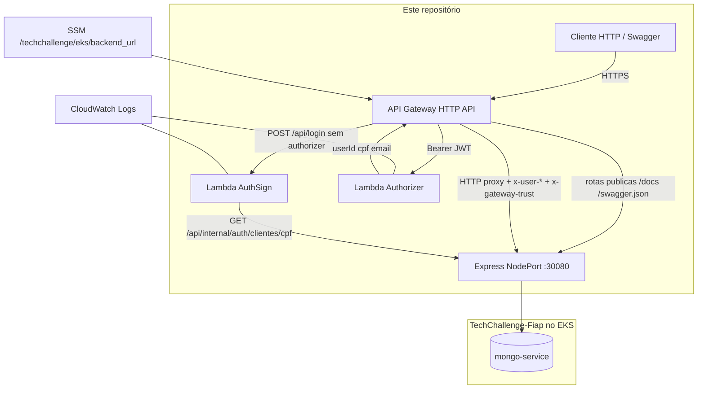

# TechChallenge-lambda-auth

Borda de autenticação da **oficina Node-Fiap**: Lambdas JWT (`auth-sign`, `auth-authorizer`) e API Gateway HTTP que faz proxy autenticado para a API no EKS.

Este repositório entrega **somente auth e Gateway**. A API, o cluster e o Mongo vivem nos [repositórios irmãos](#repositórios-irmãos).

O Terraform **sempre** usa o state `lambda-auth/terraform.tfstate` no bucket compartilhado. Assim o apply não aponta para o state do EKS.

## Propósito

- Emitir JWT na borda (`POST /api/login`) a partir do **CPF** do cliente (status `ATIVO`).
- Validar o Bearer no Authorizer do API Gateway e injetar `x-user-id`, `x-user-cpf`, `x-user-email` e `x-gateway-trust` no pod.
- Expor o Swagger da API pelo mesmo Gateway (rotas públicas `/docs` e `/swagger.json`).
- Reproduzir o mesmo fluxo no notebook com SAM local (porta `3001`).

Decisões: [RFC-003](docs/rfcs/003-autenticacao-jwt-api-gateway.md) e [ADR-003](docs/adrs/003-autenticacao-jwt-api-gateway.md). Sequência: [docs/ARQUITETURA-SEQUENCIA-AUTENTICACAO.md](docs/ARQUITETURA-SEQUENCIA-AUTENTICACAO.md).

## Tecnologias

| Camada | Tecnologia |
|---|---|
| Runtime | Node.js 20 (Lambdas) |
| Auth | JWT HS256 (`jsonwebtoken`) |
| Validação | `cpf-cnpj-validator` |
| Borda | API Gateway HTTP API + Lambda Authorizer |
| IaC | Terraform 1.11 |
| Local | AWS SAM (`sam local start-api`) |
| Testes | Jest |
| CI/CD | GitHub Actions (CI + Terraform manual) |

## Arquitetura deste repositório

O que **este** repo provisiona. O Express e o Mongo ficam fora.



Visão completa da nuvem: [diagrama de componentes no Fiap](https://github.com/RuannGodinho/TechChallenge-Fiap/blob/main/docs/ARQUITETURA-COMPONENTES.md).

## APIs — Swagger e contrato de login

O OpenAPI **não** é gerado aqui: o Gateway só publica o Swagger da API.

| Ambiente | Swagger UI | OpenAPI JSON (importe no Postman) |
|---|---|---|
| SAM local | [http://127.0.0.1:3001/docs](http://127.0.0.1:3001/docs) | [http://127.0.0.1:3001/swagger.json](http://127.0.0.1:3001/swagger.json) |
| Produção (API Gateway) | `https://<api-id>.execute-api.us-east-1.amazonaws.com/docs` | `https://<api-id>.execute-api.us-east-1.amazonaws.com/swagger.json` |

Contrato canônico da API: [TechChallenge-Fiap / CONTRATO-AUTH-CPF.md](https://github.com/RuannGodinho/TechChallenge-Fiap/blob/main/docs/CONTRATO-AUTH-CPF.md).

**Login (rota deste repo, sem authorizer):**

```http
POST /api/login
{ "cpf": "81788455045" }
```

| Resultado | HTTP | Quando |
|---|---|---|
| `{ "token": "<jwt>" }` | 200 | CPF válido, cliente `ATIVO` |
| `CPF é obrigatório` / `CPF inválido` | 400 | Documento ausente ou inválido |
| `Cliente não encontrado` | 401 | CPF sem cadastro |
| `Cliente inativo` | 403 | Cliente `INATIVO` |

Seed: `81788455045` (ATIVO), `52263606068` (INATIVO). Nas demais rotas: `Authorization: Bearer <token>`.

A AuthSign consulta `GET {BACKEND_URL}/api/internal/auth/clientes/{cpf}` com `x-gateway-trust`. Payload do JWT: `{ userId, cpf, email }`.

## Requisitos

- Node.js 20.x e npm 10+ (testes e invoke local)
- AWS SAM CLI (opcional, para `sam local start-api`)
- Terraform 1.11 e AWS CLI (deploy)
- Cluster do [TechChallenge-infra-eks](https://github.com/RuannGodinho/TechChallenge-infra-eks) com SSM `/techchallenge/eks/backend_url`
- API no NodePort `30080` ([TechChallenge-Fiap](https://github.com/RuannGodinho/TechChallenge-Fiap)) já no ar
- Secrets: `JWT_SECRET`, `GATEWAY_TRUST_SECRET`

## Execução local

```text
auth/                 # código Lambda (Jest + SAM)
terraform/            # Lambda, IAM, API Gateway
```

O empacote (`terraform/scripts/prepare-auth-lambda.js`) instala deps de produção em `auth/` e gera `terraform/builds/auth-lambda.zip`.

### Testes (só Node)

```bash
cd auth
npm ci
npm test
```

### SAM (Gateway simulado)

A API Express do [TechChallenge-Fiap](https://github.com/RuannGodinho/TechChallenge-Fiap) precisa estar em `:3000` com `AUTH_MODE=gateway` (`docker-compose.yml` + `docker-compose.sam.yml`).

```bash
cd auth
cp .env.local.example .env.local   # JWT_SECRET, BACKEND_URL, GATEWAY_TRUST_SECRET
npm run sam:build
npm run sam:start                  # http://127.0.0.1:3001
npm run sam:invoke:login           # body { "cpf": "81788455045" }
```

## Deploy

Ordem ponta a ponta: **EKS → Mongo → API no K8s → este repo**.

```bash
cd terraform
cp terraform.tfvars.example terraform.tfvars
# backend.hcl: mesmo bucket S3 do EKS, key lambda-auth/terraform.tfstate
terraform init -backend-config=backend.hcl
terraform plan
terraform apply
```

Env da AuthSign: `JWT_SECRET`, `JWT_EXPIRES_IN`, `BACKEND_URL` (SSM) e `GATEWAY_TRUST_SECRET`.

## Pipeline

| Workflow | Gatilho | Efeito |
|---|---|---|
| CI (`.github/workflows/ci.yml`) | push/PR | Jest em `auth/` + `terraform fmt/validate` |
| Terraform (`.github/workflows/terraform.yml`) | `workflow_dispatch` | plan / apply / destroy (`confirm=yes`) |

Secrets GitHub: `JWT_SECRET`, `GATEWAY_TRUST_SECRET`, `AWS_ACCESS_KEY_ID`, `AWS_SECRET_ACCESS_KEY`, `TF_STATE_BUCKET`.

## Repositórios irmãos

| Repositório | Papel |
|---|---|
| [TechChallenge-Fiap](https://github.com/RuannGodinho/TechChallenge-Fiap) | API, Swagger, lookup interno do CPF |
| [TechChallenge-infra-eks](https://github.com/RuannGodinho/TechChallenge-infra-eks) | VPC, EKS, SSM `backend_url` |
| [TechChallenge-infra-db](https://github.com/RuannGodinho/TechChallenge-infra-db) | Mongo no EKS + Atlas opt-in |

## Documentação

| Documento | Conteúdo |
|---|---|
| [Sequência — Autenticação](docs/ARQUITETURA-SEQUENCIA-AUTENTICACAO.md) | Login por CPF, JWT e Authorizer |
| [RFC-003](docs/rfcs/003-autenticacao-jwt-api-gateway.md) / [ADR-003](docs/adrs/003-autenticacao-jwt-api-gateway.md) | Decisão da borda JWT |
| [Contrato CPF na API](https://github.com/RuannGodinho/TechChallenge-Fiap/blob/main/docs/CONTRATO-AUTH-CPF.md) | Body, status codes e lookup interno |
| [Índice da solução](https://github.com/RuannGodinho/TechChallenge-Fiap/blob/main/docs/ARQUITETURA.md) | Checklist do enunciado |
