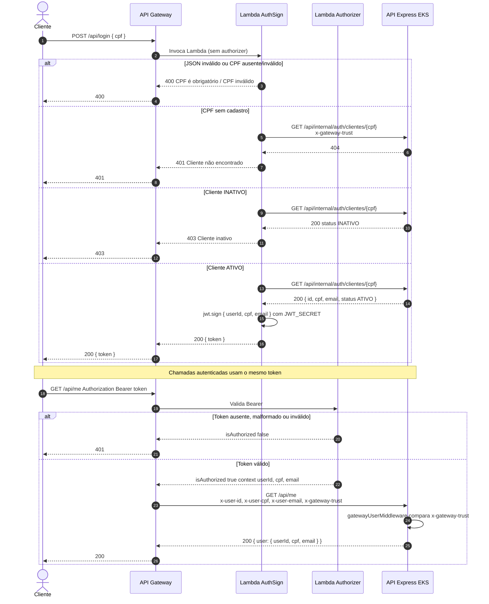

# Diagrama de Sequência — Autenticação

Fluxo de login e validação de JWT na solução **Node-Fiap**, em produção (`AUTH_MODE=gateway`).

O login **não** chega ao pod Express para assinar o token. A Lambda `AuthSign` **deste** repositório valida o CPF na API (lookup interno) e emite o JWT; o **API Gateway Authorizer** valida o Bearer nas demais rotas.

Índice da solução: [TechChallenge-Fiap / ARQUITETURA.md](https://github.com/RuannGodinho/TechChallenge-Fiap/blob/main/docs/ARQUITETURA.md). Componentes: [ARQUITETURA-COMPONENTES.md](https://github.com/RuannGodinho/TechChallenge-Fiap/blob/main/docs/ARQUITETURA-COMPONENTES.md). Decisão: [RFC-003](rfcs/003-autenticacao-jwt-api-gateway.md) / [ADR-003](adrs/003-autenticacao-jwt-api-gateway.md).

| O que o enunciado pede | Neste documento |
|---|---|
| Sequência do fluxo de autenticação | Diagrama abaixo: login por CPF sem authorizer → JWT → chamada autenticada (`GET /api/me`) |

---

## Diagrama

---

## Contrato do login

| Item | Valor |
|---|---|
| Método e path | `POST /api/login` |
| Body | `{ "cpf": "81788455045" }` |
| Sucesso | `200 { "token": "<jwt>" }` |
| Payload do JWT | `{ userId, cpf, email }` |
| Algoritmo | HS256 (`JWT_SECRET`) |
| Expiração | `JWT_EXPIRES_IN` (default `1h`) |
| Header nas demais rotas | `Authorization: Bearer <token>` |

| Resultado | HTTP | Quando |
|---|---|---|
| Token | 200 | CPF válido, cliente existe, `status = ATIVO` |
| `CPF é obrigatório` / `CPF inválido` | 400 | Documento ausente ou inválido |
| `Cliente não encontrado` | 401 | CPF válido sem cadastro |
| `Cliente inativo` | 403 | Cliente com `status = INATIVO` |

Seed da demo: `81788455045` (ATIVO), `52263606068` (INATIVO).

Headers injetados pelo Gateway no backend (não devem ser forjados pelo cliente):

- `x-user-id` / `x-user-cpf` / `x-user-email` — contexto do authorizer
- `x-gateway-trust` — segredo compartilhado (`GATEWAY_TRUST_SECRET`), comparado com `crypto.timingSafeEqual`

Tentativa de login direto no NodePort, com `AUTH_MODE=gateway`, retorna **410** (`Login disponível apenas via API Gateway`).

---

## Modo local (Docker Compose + SAM)

Com `AUTH_MODE=local` (default), o Express no [TechChallenge-Fiap](https://github.com/RuannGodinho/TechChallenge-Fiap) autentica internamente pelo mesmo contrato de CPF. Esse modo não é o de produção no EKS.

Auth com Gateway simulado: API com `AUTH_MODE=gateway` + `sam local start-api` neste repo (porta 3001). Ver README da raiz.

---

## Documentação relacionada

- [docs deste repo](README.md)
- [RFC-003](rfcs/003-autenticacao-jwt-api-gateway.md) / [ADR-003](adrs/003-autenticacao-jwt-api-gateway.md)
- [Sequência — Abertura de OS](https://github.com/RuannGodinho/TechChallenge-Fiap/blob/main/docs/ARQUITETURA-SEQUENCIA-ORDEM-SERVICO.md)
- [Diagrama de Componentes](https://github.com/RuannGodinho/TechChallenge-Fiap/blob/main/docs/ARQUITETURA-COMPONENTES.md)
