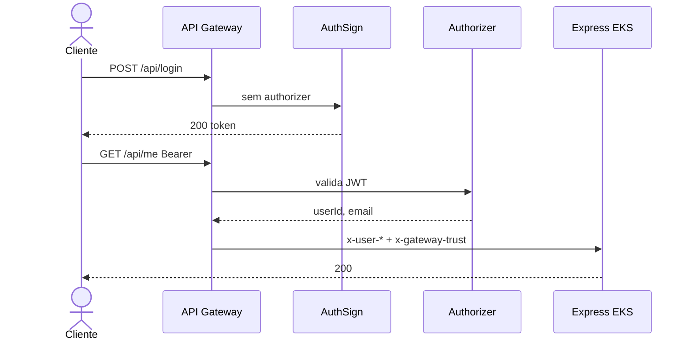

# RFC – Autenticação JWT serverless no API Gateway

**Casa:** Lambdas e API Gateway **neste** repositório. `AUTH_MODE=gateway` e middleware da API: [TechChallenge-Fiap](https://github.com/RuannGodinho/TechChallenge-Fiap).

| Campo | Valor |
|---|---|
| **Número** | 003 |
| **Data** | 21/08/2026 |
| **Autor** | Ruann Correa Godinho |
| **Status** | Encerrada – Aprovada |
| **ADR** | [ADR-003](../adrs/003-autenticacao-jwt-api-gateway.md) |

## Resumo

Centralizar login e validação de sessão na borda AWS: Lambda **AuthSign** emite JWT (HS256) e o **Authorizer** valida o Bearer no API Gateway. O pod Express, com `AUTH_MODE=gateway`, não autentica o cliente — só confia nos headers injetados pelo Gateway.

## Problema

A API expõe CRUD de clientes, veículos, estoque e OS. Sem um contrato único de autenticação, cada rota (ou cada squad futuro) poderia validar JWT de um jeito diferente — exatamente o cenário que a aula cita como risco de **não** registrar a decisão.

Validar token **somente** no Express deixa o NodePort `30080` como superfície: quem alcançar o IP do node bypassa a borda. Validar **somente** em middleware de aplicação também mistura identidade com regra de negócio e impede o login de ser um serviço independente (este repo).

O laboratório precisa de auth demonstrável (login, 401, JWT, rota `/api/me`) sem Cognito pago nem IdP corporativo, e com o mesmo fluxo simulável via SAM local.

## Proposta técnica

Dois modos, um contrato de token:

| Modo | Onde | Uso |
|---|---|---|
| `AUTH_MODE=local` (default do Compose) | Express assina e valida JWT | Desenvolvimento e testes da API ([TechChallenge-Fiap](https://github.com/RuannGodinho/TechChallenge-Fiap)) |
| `AUTH_MODE=gateway` (EKS / SAM) | Lambda AuthSign + Authorizer | Produção de laboratório (este repo) |

**Produção (`gateway`)**

1. `POST /api/login` no API Gateway **não** usa authorizer. A Lambda AuthSign valida `AUTH_EMAIL` / `AUTH_PASSWORD` e devolve `{ token }`.
2. Demais rotas enviam `Authorization: Bearer <jwt>`. O Authorizer verifica assinatura HS256 (`JWT_SECRET`) e devolve `userId` e `email`.
3. O Gateway faz proxy ao EKS e injeta `x-user-id`, `x-user-email` e `x-gateway-trust`.
4. O `gatewayUserMiddleware` na API compara o trust com `GATEWAY_TRUST_SECRET` (`crypto.timingSafeEqual`). Login direto no NodePort responde **410**.

JWT: algoritmo **HS256**, payload `{ userId, email }`, expiração `JWT_EXPIRES_IN` (default `1h`).

Rotas públicas no Gateway: `POST /api/login`, Swagger (`/docs`, `/swagger.json`) e a consulta de OS por documento (`GET /api/ordensServico/:cpfCnpj/detalhes`).

Detalhe do fluxo: [Sequência — Autenticação](../ARQUITETURA-SEQUENCIA-AUTENTICACAO.md).

## Impacto esperado

**Ganhos**

- Um único ponto de emissão/validação de token na borda; o domínio da oficina não implementa OAuth.
- Superfície do NodePort reduzida: sem trust header válido, o pod não aceita o usuário.
- Lambdas escalam a zero; custo de auth no laboratório é desprezível.
- Logs de login e 401 ficam no CloudWatch, separados dos logs da API.
- SAM local (`BackendProxyFunction` → `localhost:3000`) reproduz o Gateway sem conta AWS.

**Riscos e restrições**

- Credenciais de laboratório são um único par `AUTH_EMAIL` / `AUTH_PASSWORD` — não há IdP, refresh token nem usuários reais.
- HS256 com segredo compartilhado exige o mesmo `JWT_SECRET` na Lambda e, no modo local, na API. Rotação é manual.
- `x-user-*` só é confiável se o NodePort não for alcançável por clientes que também conheçam `GATEWAY_TRUST_SECRET`. O segredo precisa ficar no Secret/SSM, nunca no repositório.
- Authorizer em Lambda adiciona latência (cold start) em cada request autenticada; volume de aula absorve isso.
- `GET /api/ordensServico/:cpfCnpj/detalhes` permanece público — decisão de produto, detalhada na [RFC-015 do Fiap](https://github.com/RuannGodinho/TechChallenge-Fiap/blob/main/docs/rfcs/015-consulta-publica-os.md).

## Alternativas consideradas

| Alternativa | Por que foi descartada |
|---|---|
| **Amazon Cognito** (User Pool + JWT RS256 no Gateway) | Caminho “AWS nativo” de produção. Para o challenge, soma User Pool, app client, hosted UI e custo/complexidade sem ganho pedagógico frente a duas Lambdas e um secret. |
| **JWT só no Express** (sem Gateway) | Simples no Compose, mas o NodePort vira a borda real. Contraria o desenho “cliente HTTP acessa apenas o API Gateway”. |
| **Sessão server-side** (cookie + Redis/Memory) | HPA com 1–4 réplicas exigiria store compartilhado. REST + Swagger + clientes não-browser (curl) combinam melhor com Bearer. |
| **OAuth2 / OIDC completo** (Keycloak, Auth0) | Correto para multi-app e SSO. Fora do escopo: um usuário mock e um recurso API. |
| **mTLS entre Gateway e o node** | Mais seguro que trust header, porém exige certificados e, na prática, um ALB/NLB — custo e operação que a [RFC-001 no infra-eks](https://github.com/RuannGodinho/TechChallenge-infra-eks/blob/main/docs/rfcs/001-adocao-aws.md) evitou de propósito. |
| **API keys estáticas no Gateway** | Não demonstram login, expiração nem identidade (`userId` / `email`) em `/api/me`. |

## Pontos em aberto

- Migrar HS256 → RS256 (chave no SSM/KMS, authorizer JWT nativo do HTTP API) se a banca ou a fase seguinte exigir IdP.
- Trocar o usuário único por uma coleção `Usuario` no Mongo, ainda emitindo o token na Lambda (lookup) ou mantendo o mock até haver gestão de perfil.
- Refresh token e logout (denylist) — não existem neste recorte; a mitigação atual é TTL de 1h.
- Restringir o Security Group do node para que só o API Gateway alcance a porta `30080`, reduzindo a dependência exclusiva do `x-gateway-trust`.
